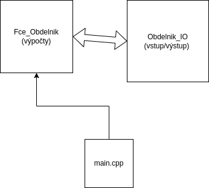

# Modulární programování, objektové modelování

## 1. Nastudujte si ukázky příkladů.
**Visual Studio, C++**

Rozdělení implementace problému výpočtu obdélníka v projektu `Application_12`, `Application_14` do modulů je nedostatečné. Modul `Fce_Obdelnik` dopočítává správně údaje obdélníka, ale navíc obsahuje metody závislé na uživatelském rozhraní. Modul `Fce_Obdelnik` tak není plně využitelný v jiném typu aplikace. 

**a)**
- Vytvořte modul např. `Obdelnik_IO` *(nebo `IO_Obdelnik`)*, který bude realizovat standardní vstup a výstup konzolové aplikace. 
- Nový modul zaintegrujte do projektu tak, aby byl projekt kompilovatelný a spustitelný. Nakreslete schéma, které bude vizualizovat závislost mezi moduly.

**Výstupem: dokladovat rozhraní modulů a jejich provázanost (vizualizace závislostí).**

 

**b)**
- Každý modul má v překladu objektový soubor s příponou .obj. Podívejte se na datumy vytvoření těchto souborů a něco změňte v libovolném modulu. 
- Sledujte datumu objektových souborů po překladu a odvoďte logický závěr (proč)?

Výstup: upravené zdrojové kódy, diskuze nad výsledky pozorování modulárního překladu.

## 2. 

- V prostředí Visual Studio, v jazyce C# vytvořte vlastní knihovnu *(třídu)* matematických funkcí pojmenovanou Math. Bude obsahovat metodu pro výpočet faktoriálu čísla, implementujte a doplňte dokumentační komentáře. Použijte v programu vlastní knihovnu a již dostupnou knihovnu Math. 

Knihovnu vyexportujte do knihovny `MyMathLibrary`. 
